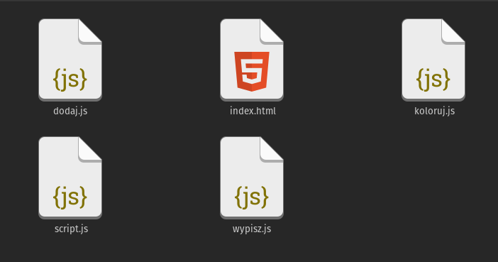
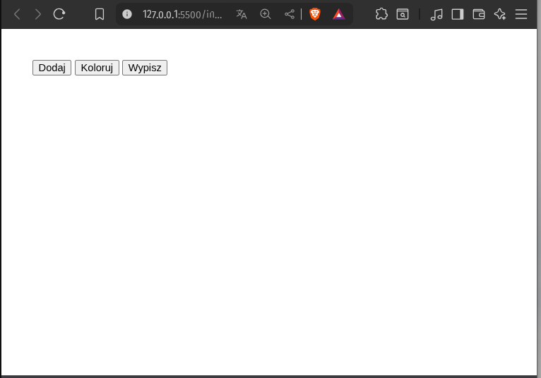
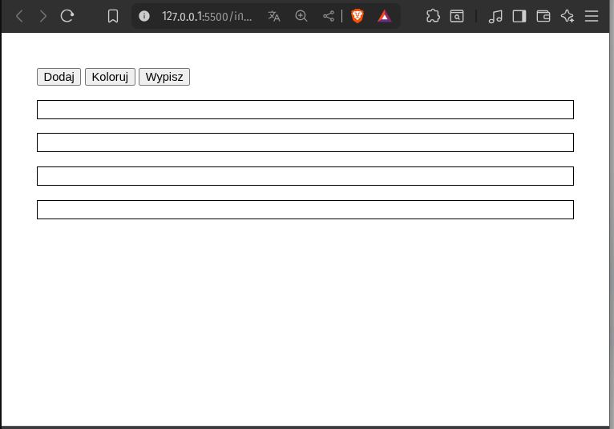
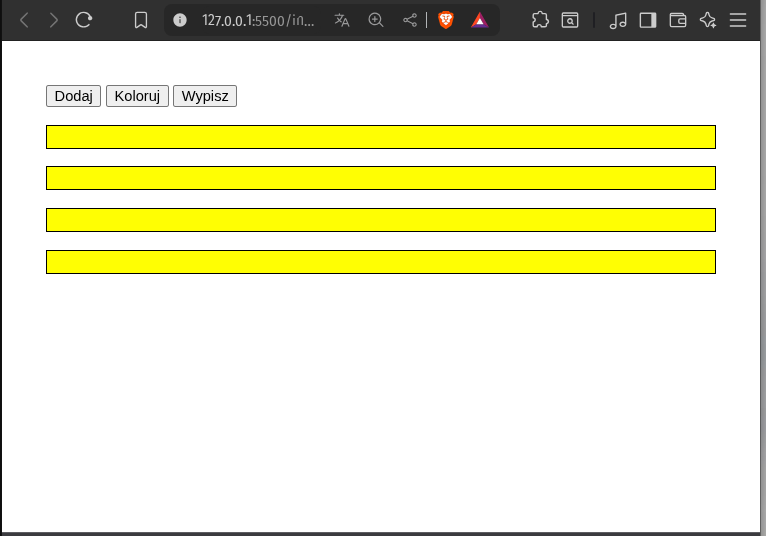
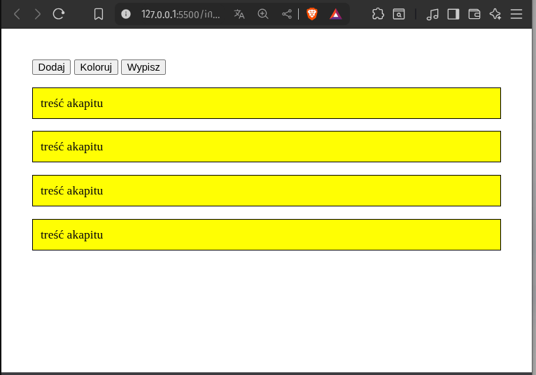

# PITSI403-API


[Web Developer Roadmap (2025) - Everything is Changing](https://www.youtube.com/watch?v=EzTxYQmU8OE)

##HTML/CSS/JS Powtórzenie

### 1. TAGS

* html
* head,body,meta,title
* h1-h6
* p,i,b
* a
* table,tr,td

### 2. ATTRIBUTES
* lang,charset,name,content
* colspan,rowspan

### 3. SEMANTIC HTML5 TAGS (header, nav, article, section, aside, footer)

### 4. CSS (kaskadowość, grupowanie, diedziczenie, class, id)
 ( float, display )
 ( BOX Model )
 ( Img, Background)
 ( Colors, Fonts, Icons)
 ( pseudoklasy i pseudoelementy )

### 5. Moduły JS
- defer, module, 
- export, import


### 6. FETCH, AXIOS
---
### Aplikacja internetowa: AW-prolog

#### "Quiz sprawdzający znajomość treści prologów do filmów STAR WARS."

#### a. Wprowadzenie 

Aplikacja to quiz sprawdzający znajomość treści tekstów wprowadzeń do filmów STAR WARS. Uzytkownik będzie zgadywał z którego filmu (epizodu) pochodzi wysiwetlany tekst. Właściwy tekst będzie wyswietlany losowo (losowy wybór epizodu). Czas odgadywania będzie mierzony i będzie stanowił o wyniku gry/quizu.

### b. Projekt graficzny
Aplikacja bedzie responsywnie zajmować cały obszar przeglądarki. Ekran podzielony na trzy sekcje: tytuł z zegarem, tekst scrollowany i stopka z wyborem epizodu.

wireframe

projekt

#### c. Przebieg rozgrywki:

 Tekst począątkowo bedzie widoczny częściowo i odgadujący najszybciej zdobedą nawiecej punktów.

#### d. Cechy wyróżniające

atrakcyjna wizualnie forma quizu - Prolog scrolluje sie jak w oryginale z użyciem podobnego kroju czcionki, z zastosowaniem trójwymiarowego zniekształcenia.

#### e. Technologie
- Rest API: swapi.info
- Javascript
- CSS 3D
---

### 7. ZADANIA

#### ZAD40301.
Przygotuj trzy funkcje javascript w osobnych plikach, które wykonują trzy zadania, które można zaimportować do dowolnego skryptu:
- dodawanie akapitu (z czarnym obramowaniem)
- zmiana koloru tła akapitów
- wypełnienie jednakową treścią akapitów ()


```
PLIKI:
index.html
script.js
dodajAkapit.js
koloruj.js
napisz.js
```
<!--  -->

kod pliku html:

```html
<!DOCTYPE html>
<html lang="en">
 <head>
    <meta charset="UTF-8">
    <meta name="viewport" content="width=device-width, initial-scale=1.0">
    <title>Document</title>

   ---

 </head>
 <body>
  <button>Dodaj akapit</button>
  <button>Koloruj akapity</button>
  <button>Wypisz w akapitach</button>
  <div id="akapity"></div>
 </body>
</html>
```
funkje do użycia
```
getElementById()
getElementsByTagName()
querySelectorAll()
querySelector()
createElement()
appendChild()
```
<!--




-->

#### ZAD40302. Przygotuj animowany (obracający się wokół osi pionowej) sześcian.

#### ZAD40303. Rozwiń twórczo koncept animowanego sześcianu. Zmodyfikuj istniejącą animację CSS w następujących obszarach:
- interakcja
- tekstury
- multiplikacja (kostka w kostce)
- explode
- glow

#### ZAD40304. Wymyśl i wykonaj aplikację uzytkową lub grę z zastosowaniem zewnętrznego API - [swapi.info](https://swapi.info/)

```json
{
    "films": "https://swapi.info/api/films",
    "people": "https://swapi.info/api/people",
    "planets": "https://swapi.info/api/planets",
    "species": "https://swapi.info/api/species",
    "vehicles": "https://swapi.info/api/vehicles",
    "starships": "https://swapi.info/api/starships"
}
```


https://fontsinuse.com/uses/49364/star-wars-opening-crawl-and-titles

ZASTRZEŻENIE: zachować obecne nazewnictwo klas i id obiektów.
```


https://www.w3.org | https://validator.w3.org | https://www.php.net/manual/en/
### --------Repositiories
https://www.w3schools.com | https://stackoverflow.com | https://css-tricks.com |
### --------On line editors
https://codepen.io/ | https://codesandbox.io/ | https://jsfiddle.net/ |
### ---------Assets
https://cdnjs.com/ | https://fontawesome.com | http://fontello.com/ | https://fonts.google.com/ |
### ---------Stock Img
https://www.pexels.com/ | https://unsplash.com | https://pixabay.com | https://imgix.com/
### ---------Tuts
https://pasja-informatyki.pl/, https://www.youtube.com/user/MiroslawZelent

Hello Roman https://www.youtube.com/channel/UCq8XmOMtrUCb8FcFHQEd8_g

Overment https://www.youtube.com/channel/UC_MIaHmSkt9JHNZfQ_gUmrg


-------------------------------------

DevEd - https://www.youtube.com/channel/UClb90NQQcskPUGDIXsQEz5Q 

Telmo Sempaio - https://www.youtube.com/user/Telmo87

Traversy Media - https://www.youtube.com/user/TechGuyWeb

Academind -https://www.youtube.com/channel/UCSJbGtTlrDami-tDGPUV9-w

Codestackr -https://www.youtube.com/channel/UCDCHcqyeQgJ-jVSd6VJkbCw

WebDevSimplified -https://www.youtube.com/channel/UCFbNIlppjAuEX4znoulh0Cw

Programming With Mosh -https://www.youtube.com/user/programmingwithmosh

Net Ninja -https://www.youtube.com/channel/UCW5YeuERMmlnqo4oq8vwUpg

Sexy Design Course -https://www.youtube.com/user/DesignCourse

Florin Pop -https://www.youtube.com/channel/UCeU-1X402kT-JlLdAitxSMA

IHateTomatoes -https://www.youtube.com/user/ihatetomatoesblog

Stephen Grider -https://www.youtube.com/channel/UCQCaS3atWyNHEy5PkDXdpNg

Colt Steele -https://www.youtube.com/channel/UCrqAGUPPMOdo0jfQ6grikZw

Wes Baws - https://www.youtube.com/user/wesbos

Ex Tech Lead -https://www.youtube.com/channel/UC4xKdmAXFh4ACyhpiQ_3qBw

MMTuts -https://www.youtube.com/user/TheCharmefis

Derek Banas - https://www.youtube.com/user/derekbanas

Programming With Erik -https://www.youtube.com/channel/UCshZ3rdoCLjDYuTR_RBubzw

TheNewBoston - https://www.youtube.com/user/thenewboston 
### ---------License
[MIT](https://choosealicense.com/licenses/mit/)
